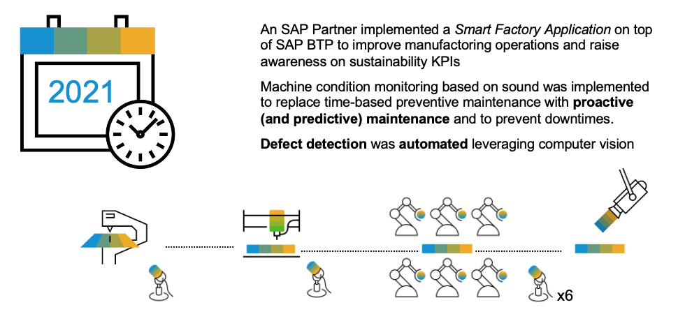
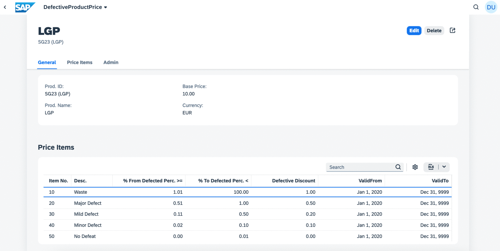
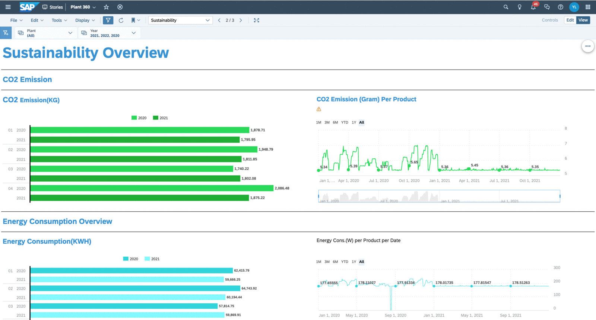

# Building Intelligent Scenarios and Sustainability on SAP BTP with SAP AI Core and SAP Analytics Cloud for Planning
<!--- Register repository https://api.reuse.software/register, then add REUSE badge:

-->

No doubt Sustainability is a hot topic in recent years. To have a sustainable environment for future generations, we need to take climate action for zero emission of greenhouse gas. In our economy, we should embrace a new circular economy model instead the tranditional take-make-waste linear model for zero waste. In our society, we fight against injustice and inequality for zero inequality. Modern Technologies play an important role to achieve these sustainability goals, such as AI(Artificial Intelligence), IoT(Internet of Things), Cloud Computing etc. In SAP, we have a name for these technologies as Intelligent Technologies.

AI(Artificial Intelligence) and Sustainability are the very frontier of frontiers in today's digital technologies, where count for enormous oppotuines in various industries. 

In agriculture, AI can transform agricultural production by better monitoring and managing environmental conditions, and higher crop/livestock yields. For example, Drone can fly over and film the field, and Computer Vision Algorithm can be applied for Automated Pest & Disease Diagnosis of crops etc. Another example in grape field, IoT sensors are used to monitor the light, wind, humility and temperature etc environmental factors, while AI algorithms come in to help with prediction on when to water, fertise and harvest. 

In manufacturing, AI can help factories by improving production efficiency, and reducing waste, energy consumption and Green House Gas Emissions. Such as automatic defect detection for production with computer vision.

In SAP, we put Sustainability into the core of our strategy, having a vision to enable every customer to become a Sustainable Intelligent Enterprise. We have developed this AI&Sustainability Bootcamp to inspire and enable our partners to build intelligent scenarios and sustainability on BTP with AI and Planning.

## Description
This github repository includes the sample code and exercises of the btp-ai-core-bootcamp, which is developed and delivered by Partner Ecosystem Success Organization (formerly known as GPO) of SAP SE, showcasing SAP partners how to add <b>Intelligence</b> and <b>Sustainability</b> into your industry cloud solutions on SAP Business Technology Platform with SAP AI Core/SAP Launchpad and SAP Analytics Cloud for Planning. The bootcamp uses an end-to-end storyline about a Sustainable Smart Factory filled with Intelligence and Sustainability
- Building a deep learning [Image Segmentation Model](src/ai-models/defect-detection) on product images with SAP AI Core for automatic Defeat Detection in production lines
- Building a deep learning [Sound Anomaly Classificaiton Model](src/ai-models/predictive-maintenance) on acoustical sounds of machinery with SAP AI Core for condition monitoring based Predictive Maintenance 
- Configure and Deploy the [sustainable-smart-factory-app](src/sustainable-smart-factory-app)(CAP based) to your own SAP HANA Cloud  
- Creating a Plant 360 story to analyse Production and Sustainability KPIs of plant such as production, defective rate, energy consumption and CO2 emission etc SAP Analytics Cloud.
- Maintenance Cost Planning with Predictive Planning of SAP Analytics Cloud for Planning. 
- Sustainability Planning and Energy Rate Prediction with Predictive Planning of SAP Analytics Cloud for Planning.

### Target Audience
The bootcamp showcases an end-to-end process of building intelligece and sustainabality scenarios on SAP BTP with AI and Planning, which involve serveral personas as below, also as a reflection of real-life to build an industry cloud solution of Intelligence and Sustainability.
* Data Scientist or Machine Learning Engineer, who are responsible for building,training and serving AI Models as APIs.
* Application Developer, who is in charge of creating a cloud-based application which will extend the backend ERP with industry-related business process in a side-by-side manner, record and collect the sustainability data in daily business process, and inference the AI Models APIs. 
* Enterprise Planning Consultant or Analytics Consultant, who can help to make sense of the sustainability KPIs along with business KPIs for coporate performance management, and assure the planning and execution of sustainability goals.

### Solution Architecture

- SAP AI Core and SAP AI Launchpad:  
Streamline the execution and operations of Deep Learning Models in a standardized, scalable, and hyperscaler-agnostic way  
    * [Image Segmentation Model for Auto. Defect Detection](src/ai-models/defect-detection)
    * [Sound Anomaly Classificaiton Model for Predictive Maintenance](src/ai-models/predictive-maintenance)

- [Sustainable Smart Factory Application](src/sustainable-smart-factory-app):  
A CAP-based application on BTP glues all the pieces together by inferencing the AI models with IoT streaming data(product images from camera, machinery sound collectec by the), and recoridng data of plant daily operaiton and sustainability KPIs, extending [Maintenance Management of SAP S/4HANA Cloud](https://help.sap.com/docs/SAP_S4HANA_CLOUD/2dfa044a255f49e89a3050daf3c61c11/f9f9400b81de4235b910887d91d925c4.html?version=2202.500) with [Predictive Maintenance](https://en.wikipedia.org/wiki/Predictive_maintenance)
    * Auto. Defect Detection 
    -Quality records via computer vision
    * Sound-based Predictive Maintenance 
    -Historical conditions of plant and equipment, and sound anomalies  
    -Integration with Maintenance Management of SAP S/4HANA Cloud
- SAP S/4HANA Cloud 
    * Central Master Data for Products and Equipments
    * Maintenance Management
- SAP Analytics Cloud for Planning
    * Plant 360 story
    * Maintenance Cost Planning
    * Sustainability Planning and Energy Rate Prediction

### Storyline
Bagnoli Co. is a famous manufacturer of Light Guide Plates (LGP) used in LED panels since 2008, based in Milan, Italy. The company has design and manufacturing of LGP, adopted SAP S/4HANA Cloud as digtial business platfrom since 2020. The Bagnoli brothers have a vision to become an sustainable smart LGP manufacturer by reducing waste and improving production effeciency and workplace safety. In 2021, An SAP gold partner has been hired to implement their vision with SAP Business Technology Platform. SAP AI Core has been proposed to optimise these business process efficiency in quality inspection with computer vision, and sound anonaly detection based predictive maintenance in which sustainability key figures are recorded during plant daily operation such as energy consumption and CO2 emission. And SAP Analytics Cloud for Planning is also suggested to provide insights of production and sustainability KPI to plant manager, also used for Planning of Maintenance Cost  and Sustainability. And a CAP-based Sustainable Smart Factory Application is also created for end users to glue different components for extending SAP S/4HANA Cloud in Quality Inspection and Maintenance Management with intelligence and sustainability.
- LGP Product 
Light Guide Plates (LGP) is used in LED panels, which can transform a line light source into a surface light source, widely applied in liquid crystal display screens such as computer monitors, car navigations, and PADs.

- Factory Layout

- 2020 before implementing sustainable-smart-factory-app  

- 2021 after implementing sustainable-smart-factory-app  

### Final Outcomes
#### Sustainable Smart Factory App

#### Auto. Defect Detection

#### Predictive Maintenance

#### Plant 360

#### Maintenance Cost & Sustainability Planning

## Requirements
### Software Requirements
System access below for exercises will be provided in bootcamp by SAP. Therefore, no action required for the bootcamp participants.
- SAP AI Core
- SAP AI Launch Pad
- SAP Analytics Cloud for Planning
- SAP S/4HANA Cloud
### Other Requirements
- Complete the [openSAP course](https://open.sap.com/courses/sac3) about Planning with SAP Analytics Cloud

## Exercises
Please follow [this manual](exercises/README.md) to perform the excises, which allows you to replicate the end-to-end Sustainable Smart Factory solution on your own SAP BTP account as described in above. 

## More Materials
We have closedly worked with SAP HANA Academy Team for more deep dive content about AI&Sustainability based on the bootcamp storyline. If you would like to learn more, please visit this [playlist](https://youtube.com/playlist?list=PLkzo92owKnVyJ5bZXYHb8QUTNRaUMYNST) prepared by SAP HANA Academy Team.

## Download and Installation

## Known Issues

## How to obtain support
[Create an issue](https://github.com/SAP-samples/btp-ai-core-bootcamp/issues) in this repository if you find a bug or have questions about the content.
 
For additional support, [ask a question in SAP Community](https://answers.sap.com/questions/ask.html).

## Contributing
If you wish to contribute code, offer fixes or improvements, please send a pull request. Due to legal reasons, contributors will be asked to accept a DCO when they create the first pull request to this project. This happens in an automated fashion during the submission process. SAP uses [the standard DCO text of the Linux Foundation](https://developercertificate.org/).

## License
Copyright (c) 2022 SAP SE or an SAP affiliate company. All rights reserved. This project is licensed under the Apache Software License, version 2.0 except as noted otherwise in the [LICENSE](LICENSES/Apache-2.0.txt) file.
